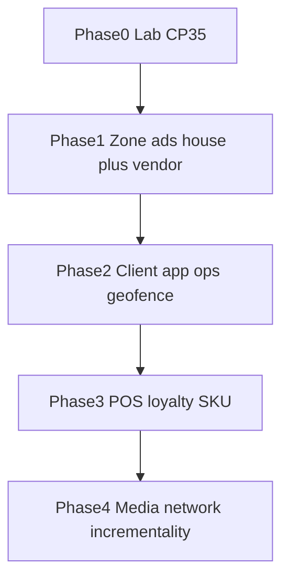

# DukaNest Proximity Campaigns — Supermarket Use Cases & Workflows

**Product:** DukaNest Proximity Campaigns  
**Primary vertical:** Supermarkets and large retail stores (as full DukaNest tenants)  
**Status:** Phase 1 implementation (vendor + house zone ads)  
**Version:** 2.0

## 1. Overview

DukaNest Proximity Campaigns uses **Bluetooth Low Energy (BLE) beacons** in physical stores, the supermarket’s **existing consumer app**, a campaign engine, and two dashboards (retailer inventory vs vendor booking).

**First sellable use case:** a vendor books a time-boxed in-app card on one or more **branches and zones**. The shopper can **claim a coupon**. Purchases at till without a claim are **not measured** until a retailer POS or loyalty basket feed exists (Phase 3).

**Core idea for Phase 1:** Right zone + right now + on-screen card. Not indoor GPS. Not shelf-level BLE. Not ROAS.

BLE beacons broadcast an iBeacon ID. The supermarket app detects that ID and DukaNest decides which creative to show. Placement, permissions, OS behaviour, and metal gondolas still apply. Adjacent supermarket shelves cannot be isolated with CP35; sell departments, not bays.

Hardware for the pilot is the **DX-CP35** (iBeacon-only, DukaNest UUID, low TX). Commission in DX-SMART for the lab; production staff config lives in the DukaNest merchant app. Never put configure-beacon APIs in the customer APK.

### Phased feature map

| Phase | What ships | Not yet |
|---|---|---|
| **0 Lab** | CP35 walk-test, TX step, UUID freeze, aisle spillover | Selling a slot |
| **1 In-store media (now)** | Branches, zones, beacons, vendor booking + retailer approve, house ads, scan SDK, commission SDK, dwell, on-screen impressions, QR fallback, dark-slot billing pause, manual invoice | POS, ROAS, DukaNest consumer app, auctions |
| **2 Scale** | DukaNest client app for stores without their own app, TLM battery, dayparts, geofence+BLE, automated invoicing, anonymized zone counts | SKU match |
| **3 Closed loop** | POS/loyalty feed, attributed purchase, inventory-aware ads, personalization, click & collect, staff assist | Marketplace |
| **4 Media network** | Multi-retailer marketplace, share of voice, incrementality, ROAS after SKU match | Shelf-level BLE (never; use QR/NFC) |

Use-case catalog mapping (original §§6–21):

- **Phase 1:** entrance welcome (§6), zone promotion (§7), advertiser campaign (§9), coupon **claim** without till redeem (§10), retail media booking (§21), campaign schedule/frequency (§22–24), retailer + vendor dashboards (§28–30), thin settlement (§31), beacon ops (§32–33), Kenya privacy copy (§34)
- **Phase 2:** post-purchase thank-you if a checkout beacon exists (§19), repeat-visit CRM (§20), cross-branch reporting
- **Phase 3:** personalized offers from purchase history (§8), closed-loop attribution (§11), recommendations / cross-sell / clearance / substitutes (§12–15), click & collect (§17), staff assistance (§18)
- **Phase 4 or never on CP35:** indoor wayfinding as GPS (§16), incrementality (§27), auction marketplace (§37)



## 2. Business Model

### Hardware / Deployment

- KSh 1,500–2,000 per deployed BLE beacon
- One-time charge
- Includes beacon, installation, configuration, registration and zone setup

### Proximity Campaign Platform

- KSh 10,000/month per branch — smaller deployments
- KSh 20,000/month per branch — larger supermarkets
- Custom enterprise pricing for large chains

### Advertising Revenue Share

Once the supermarket participates in the DukaNest Retail Media Network, third-party brands can purchase campaigns.

Example:

- Brand campaign: KSh 100,000
- Supermarket share: 70% = KSh 70,000
- DukaNest share: 30% = KSh 30,000

The exact split is contractual.

## 3. Main Actors

| Actor | Responsibility |
|---|---|
| Supermarket Admin | Manages branches, zones, beacons, campaigns and users |
| Marketing Manager | Creates and monitors campaigns |
| Store Manager | Manages store-level deployment |
| Customer | Uses supermarket app/loyalty programme |
| Brand / Advertiser | Funds promotional campaigns |
| Cashier / POS | Records transactions and redemptions |
| DukaNest | Campaign engine, dashboard, analytics and integrations |
| Supermarket Mobile App | Detects BLE proximity and presents experiences |
| POS / Loyalty System | Provides customer and transaction data |

## 4. Store Structure

```text
Retail Chain
├── Branch
│   ├── Zone
│   │   ├── Beacon
│   │   └── Campaigns
│   └── Zone
└── Branch
```

Example:

```text
Westlands Branch
├── Entrance
├── Fresh Foods
├── Beverages
├── Beauty
├── Electronics
├── Household
├── Baby Products
├── Checkout
└── Customer Service
```

Each beacon should have:

- Beacon ID
- Beacon identifier
- Branch
- Zone
- Physical location
- Installation date
- Configuration
- Status

## 5. Preferred Customer Identity

The preferred identity is the supermarket's existing **loyalty/customer ID**.

DukaNest should avoid unnecessarily storing personal customer information. Where possible, use a retailer-specific customer identifier or pseudonymous ID.

The supermarket's app remains responsible for customer login, consent and the customer relationship.

## 6. Use Case: Store Entrance Welcome

**Objective:** Welcome known customers when they enter a branch.

Workflow:

```text
Customer enters store
      ↓
Entrance beacon detected
      ↓
Supermarket app identifies customer
      ↓
DukaNest checks consent + frequency rules
      ↓
Campaign selected
      ↓
Welcome experience displayed
```

Example:

> Welcome back!  
> You have 240 loyalty points available.  
> Today's offers: 10% off selected household products.

Metrics:

- Store visits
- Detected customers
- Messages delivered
- Opens
- Offer interactions
- Subsequent purchases

## 7. Use Case: Zone-Based Promotion

Customer enters the **Beauty** zone.

```text
BLE beacon
   ↓
Beauty Zone
   ↓
DukaNest Campaign Engine
   ↓
Customer eligibility
   ↓
Campaign
```

Example:

> **Beauty Weekend**  
> Get 20% off selected products.  
> **[View Offer]**

## 8. Use Case: Personalized Offers

Combine proximity with permitted loyalty/profile data.

Example:

A customer previously purchased baby products and enters the Baby Products zone.

> **Baby Week**  
> Save 15% on selected diapers and wipes.

Possible targeting:

- Previous purchases
- Loyalty tier
- Favourite category
- Recent purchase
- Coupon history
- New customer
- Returning customer
- Branch
- Time/day

## 9. Use Case: Advertiser Campaign

Example:

- Advertiser: Coca-Cola
- Retailer: Supermarket
- Campaign: Coke Zero Weekend
- Zone: Beverages
- Duration: 7 days
- Budget: KSh 100,000

Workflow:

```text
Brand submits campaign
      ↓
Supermarket approves
      ↓
DukaNest configures campaign
      ↓
Customer enters Beverage Zone
      ↓
Eligibility checked
      ↓
Campaign delivered
      ↓
Customer engages
      ↓
Customer purchases
      ↓
POS/Loyalty transaction matched
      ↓
Campaign results calculated
```

## 10. Use Case: Digital Coupon / Redemption

This provides a simple attribution mechanism when full POS integration is not yet available.

```text
Customer receives offer
      ↓
Customer taps "Claim Offer"
      ↓
Unique coupon generated
      ↓
Customer presents at checkout
      ↓
Cashier scans/redeems
      ↓
Redemption recorded
      ↓
DukaNest updates analytics
```

Example:

```text
Campaign: COKE-WEEKEND
Customer: CUS-82731
Coupon: COKE20-82731
```

## 11. Use Case: Closed-Loop Purchase Attribution

This is the preferred long-term model.

```text
Customer ID
     ↓
BLE exposure
     ↓
Campaign interaction
     ↓
Customer shops
     ↓
Loyalty ID used at checkout
     ↓
POS transaction
     ↓
DukaNest receives transaction event
     ↓
Customer + campaign + SKU matched
     ↓
Attributed purchase
```

Example:

```text
Customer: CUS-82731
Campaign exposure: 14:32
Campaign: Coke Zero Weekend
Purchase: 16:04
Products: 2 × Coke Zero
Transaction: POS-894321
Sales: KSh 240
```

**Important:** A matched purchase should be reported as an **attributed purchase**, not automatically as a purchase caused by the campaign.

## 12. Use Case: Product Recommendation

Customer enters Coffee Zone.

> **You might also like**  
> Premium Coffee Filters — 20% off today.

Recommendation sources can include:

- Previous purchases
- Current campaign
- Product category
- Basket contents
- Loyalty profile
- Inventory

## 13. Use Case: Cross-Sell / Basket Building

Example:

Customer purchases or adds Pasta.

> **Complete your dinner**  
> Pasta + sauce + parmesan  
> **Save KSh 150**

## 14. Use Case: Clearance / Inventory Promotion

Promote products that need faster movement.

Examples:

- Excess stock
- Near-expiry products
- Seasonal products
- End-of-line products
- Slow-moving products

Example:

> **Limited-time offer**  
> Selected yoghurt products — 30% off today.

## 15. Use Case: Alternative Product

If a promoted product is unavailable:

```text
Product unavailable
      ↓
Inventory check
      ↓
Alternative selected
      ↓
Customer sees substitute
```

Example:

> The product you were looking for is unavailable.  
> Try Product B — KSh 150 off today.

## 16. Use Case: In-Store Navigation

Customer searches:

> Where can I find baby wipes?

The app provides:

> **Baby Products — approximately 40m away — Aisle 7**

BLE should be treated as a proximity/zone technology rather than exact indoor GPS.

## 17. Use Case: Click & Collect Arrival

```text
Customer arrives
      ↓
Pickup-area beacon detected
      ↓
Active order?
      ↓
YES
      ↓
DukaNest alerts staff
      ↓
Order prepared
      ↓
Customer notified
      ↓
Order handed over
```

Metrics:

- Arrival time
- Preparation time
- Handover time
- Average pickup duration

## 18. Use Case: Customer Service Assistance

Example:

> **Need help?**  
> You're near Electronics.  
> **[Request Staff Assistance]**

Staff dashboard:

> Customer assistance requested — Electronics Zone.

## 19. Use Case: Post-Purchase Engagement

After checkout:

> Thanks for shopping with us!  
> You earned 120 loyalty points.

Other possibilities:

- Receipt
- Loyalty balance
- Feedback request
- Next-purchase offer
- Related products
- Revisit campaign

## 20. Use Case: Repeat Visit / Loyalty Campaign

Example:

> **We miss you!**  
> Visit us this weekend and receive 200 bonus loyalty points.

## 21. Use Case: Retail Media / Brand Advertising

The supermarket makes selected physical zones available as advertising inventory.

Example inventory:

| Placement | Example |
|---|---|
| Entrance | Welcome / brand campaign |
| Beverages | FMCG promotions |
| Beauty | Cosmetics |
| Electronics | Phones / appliances |
| Baby | Diapers / baby products |
| Checkout | Impulse purchases |
| End-cap | Featured product |

Example revenue split:

```text
Brand campaign
KSh 100,000
      ↓
70% Supermarket = KSh 70,000
30% DukaNest   = KSh 30,000
```

## 22. Campaign Creation Workflow

### Step 1 — Campaign type

- Store promotion
- Product promotion
- Loyalty campaign
- Brand/advertiser campaign
- Clearance
- Cross-sell
- Customer retention

### Step 2 — Branch

Select one or more branches.

### Step 3 — Zone

Select the physical zone.

### Step 4 — Audience

Examples:

- All eligible customers
- Loyalty members
- New customers
- Returning customers
- Customers who bought category X
- Customers who have not purchased category X
- Custom segment

### Step 5 — Offer

Configure:

- Discount
- Coupon
- Loyalty points
- Free item
- Product recommendation
- Information
- CTA

### Step 6 — Schedule

- Start date
- End date
- Days
- Time window

### Step 7 — Frequency

Example:

> Maximum 1 notification per campaign per customer per day.

### Step 8 — Budget

For advertiser campaigns:

- Campaign budget
- Target audience
- Branches
- Zones
- Duration

### Step 9 — Review

Show:

- Estimated audience
- Selected branches
- Selected zones
- Duration
- Cost

### Step 10 — Activate

Campaign becomes active.

## 23. Campaign Engine Workflow

Every proximity event should pass through a rules engine.

```text
Beacon detected
      ↓
Identify branch + zone
      ↓
Identify customer/app session
      ↓
Check permissions/consent
      ↓
Check customer eligibility
      ↓
Check campaign schedule
      ↓
Check frequency cap
      ↓
Check campaign priority
      ↓
Check inventory/offer availability
      ↓
Select campaign
      ↓
Send/display experience
      ↓
Record event
```

## 24. Event Tracking

DukaNest should distinguish:

```text
DETECTED
DELIVERED
OPENED
CLICKED
CLAIMED
REDEEMED
PURCHASED
```

Detection does not prove that a customer saw or acted on a message.

## 25. Campaign Analytics

Example:

```text
Campaign: Coke Zero Weekend

Customers detected       18,420
Eligible customers       14,200
Messages delivered        7,820
Engaged                   3,842
Offers claimed            1,204
Offers redeemed             487
Customers purchasing        732
Units sold                1,184
Attributed sales      KSh 284,160
```

Funnel:

```text
Detected
   ↓
Eligible
   ↓
Delivered
   ↓
Engaged
   ↓
Claimed
   ↓
Redeemed
   ↓
Purchased
```

## 26. Attribution Levels

### Level 1 — Proximity Exposure

Customer entered the beacon zone.

### Level 2 — Digital Engagement

Customer opened, clicked or claimed the campaign.

### Level 3 — Redemption

Customer redeemed the offer.

### Level 4 — Matched Purchase

Customer exposed to campaign subsequently purchased the relevant product, matched through loyalty ID + POS transaction.

### Level 5 — Incremental Impact

Purchase behavior is compared with a control/holdout group.

Level 4 should be called **attributed purchase**, not automatically "caused purchase."

## 27. Incrementality / Control Groups

For mature campaigns:

```text
Exposed group
      vs.
Control group
```

Example:

| | Exposed | Control |
|---|---:|---:|
| Customers | 10,000 | 10,000 |
| Purchasers | 1,200 | 950 |
| Purchase rate | 12% | 9.5% |

DukaNest can estimate incremental effect rather than assuming every purchase following exposure was caused by the campaign.

## 28. Supermarket Dashboard

### Today's Store Activity

- Customers detected
- Active campaigns
- Campaign interactions
- Offers redeemed
- Attributed sales

### Campaign Performance

- Best campaign
- Worst campaign
- Engagement rate
- Redemption rate
- Attributed revenue

### Store Zones

```text
Entrance          8,240 visits
Beverages         5,820 visits
Beauty            4,310 visits
Electronics       2,940 visits
Fresh Foods       6,120 visits
```

### Revenue

- Campaign revenue
- Advertising revenue
- Supermarket share
- DukaNest share

## 29. Advertiser Dashboard

Advertisers should only see data they are authorized to access.

Example:

```text
Campaign: Coke Zero Weekend

Spend                 KSh 100,000
Customers reached          18,420
Engagement                   3,842
Redemptions                    487
Purchasing customers           732
Units sold                   1,184
Attributed revenue       KSh 284,160
ROAS                           2.84x
```

Advertisers should receive aggregated campaign results rather than unnecessary personal customer information.

## 30. Advertising Workflow

```text
Brand
  ↓
Creates/submits campaign
  ↓
Supermarket reviews
  ↓
Campaign approved
  ↓
DukaNest configures campaign
  ↓
Campaign goes live
  ↓
Customers interact
  ↓
POS/Loyalty data collected
  ↓
DukaNest measures results
  ↓
Campaign report generated
  ↓
Advertising revenue settled
```

## 31. Revenue Settlement

Example:

```text
Campaign revenue: KSh 100,000

Supermarket share: 70%
KSh 70,000

DukaNest share: 30%
KSh 30,000
```

Dashboard should provide:

- Campaign revenue
- DukaNest share
- Supermarket share
- Refunds/adjustments
- Settlement status
- Settlement date

## 32. Beacon Management

### Add Beacon

```text
Admin
 ↓
Add Beacon
 ↓
Scan/enter Beacon ID
 ↓
Select Branch
 ↓
Select Zone
 ↓
Configure range
 ↓
Test
 ↓
Install
 ↓
Activate
```

### Maintenance

Track:

- Status
- Battery level where supported
- Last seen
- Firmware
- Installation date
- Last maintenance
- Assigned zone

## 33. Deployment Workflow

Before installing:

1. Obtain store floor plan.
2. Map customer journey.
3. Identify high-value zones.
4. Identify advertising zones.
5. Identify entrance/exit.
6. Identify checkout/pickup areas.
7. Define campaign objectives.
8. Map beacon positions.
9. Install beacons.
10. Test on multiple phone models.
11. Test during quiet and busy periods.
12. Adjust placement/settings.
13. Activate branch.

Test for adjacent-zone interference, metal shelving, signal spillover and background app behavior.

## 34. Customer Consent and Privacy

The system should support:

- Clear explanation of proximity features
- Bluetooth permission
- Notification permission
- Appropriate location permissions where required
- Marketing opt-in
- Marketing opt-out
- Frequency limits
- Privacy policy
- Data minimization
- Retailer-controlled customer data
- Audit logs

Example:

> **Enable in-store experiences**  
> Allow Bluetooth and notifications so we can show relevant offers, help you find products and provide useful information while you shop.

## 35. Phase 1 scope (current build)

The previous “MVP” listed POS redemption and attributed sales. Those are **not** Phase 1.

### Hardware and inventory

- CP35 lab profile (iBeacon-only, DukaNest UUID, TX −13.5 dBm start, 400–800 ms, new password)
- Retailer tenant → branches → zones → beacons (MAC, QR, major/minor, last-seen)
- Dark-slot alert and vendor billing pause after 24h without last-seen

### Apps / SDK

- Scan flavor in the supermarket **consumer** app (`DukaNestProximityScan`)
- Commission flavor in DX-SMART (pilot) then the DukaNest **merchant** app
- Consent, one UUID, dwell ~2.5s, visit storm cap 3, campaign prefetch
- QR fallback on the same campaign
- Kenya privacy copy; spoofing disclosure; impression = on-screen card only

### Campaigns

- House ads (`advertiser_id` null) and vendor ads
- Vendor submit → retailer approve/reject → exclusive vendor slot per zone/branch/dates
- Creative: image, title, body, CTA, optional claimable coupon
- Schedule + Africa/Nairobi trading hours + frequency cap 1/campaign/customer/day
- Brand safety / retailer veto

### Measurement (honest)

- Detected: retailer only (not sold as reach)
- Delivered / clicked / claimed: retailer + vendor aggregates
- No customer list to vendors (ODPC)
- No till purchase, no ROAS, no “people who saw this bought X”

### Money

- Manual invoice / M-Pesa; 70/30 recorded, not auto-settled

Pilot shape: **one retailer, two branches, 3–4 zones each, one paying vendor, 2–4 week flight.**

## 36. Phase 2 — Scale the same product

- Same scan SDK in a **DukaNest client app** so stores without their own app can participate
- TLM battery voltage in last-seen; battery-swap runbook in the merchant app
- Dayparts, A/B creatives, Swahili copy
- GPS geofence “near store” then BLE inside
- Anonymized zone traffic counts for the retailer
- Cross-branch reporting for one chain
- Automated invoicing (still no SKU ROAS)
- Optional DukaNest cashier redeem screen
- Repeat-visit / “we miss you” push/SMS (CRM; does not need BLE)
- Post-purchase thank-you if a checkout beacon exists (still no basket data)

## 37. Phase 3 and Phase 4

**Phase 3 — Closed loop (needs POS or loyalty feed)**

- Loyalty ID + permitted profile for personalized offers
- Full POS or loyalty basket feed: SKU match, attributed purchase labeled as such
- Inventory-aware clearance, substitutes, “in stock in this zone”
- Recommendations / cross-sell / basket building
- Click & collect arrival at pickup beacon
- Staff assistance request in a zone
- Authenticated / rotating custom frame against spoofing

**Phase 4 — Retail media network (needs Phase 1 volume)**

- Multi-retailer marketplace, self-serve brands, share of voice / auction
- Dynamic pricing / CPM once impression quality is trusted
- Automated advertiser settlements
- Incrementality / holdouts
- Advanced ROAS only after Phase 3 SKU match
- AI campaign recommendations

**Not a DukaNest proximity-marketing phase**

- Shelf-level BLE (“this bay, not the next”) — use QR/NFC
- Indoor “40 m, aisle 7” wayfinding as GPS on CP35
- BLE payments, walk-out checkout, employee tracking
- Centimeter accuracy

## 38. End-to-End Example (Phase 1 — what we can actually report)

### Coca-Cola weekend flight (sales story vs build)

The five-branch / ROAS story below is a **later-phase sales narrative**. The first build is two branches, zone ads, claim, no POS.

```text
Advertiser: Coca-Cola
Retailer: one supermarket tenant
Branches: 2 (pilot), 5 (sales story)
Zones: Beverages (department, not the Coke bay)
Duration: 14 days
Fee: flat per zone-week (not CPM yet)
Offer: in-app card + claimable coupon
```

Customer journey we can ship:

```text
Shopper with supermarket app + Bluetooth + consent
        ↓
Enters Beverages zone (CP35 iBeacon)
        ↓
SDK waits ~2.5s dwell
        ↓
GET /api/v1/proximity/ads/current
        ↓
Vendor campaign wins over house
        ↓
In-app card on screen = delivered impression
        ↓
Optional click / claim (unique code in-app)
        ↓
Till purchase without claim = not measured
```

Phase 1 report (honest):

```text
Branches booked              2
On-screen impressions      N
Clicks                     N
Claims                     N
CTR                        clicks / impressions
Attributed sales           not available
ROAS                       not available
```

## 39. Core Product Principle

DukaNest should not position the system as:

> "BLE sends advertisements to phones."

Instead:

> **"DukaNest connects a physical store zone with the retailer’s app so the back-end can show one approved card, then count on-screen impressions and claims."**

The beacon is the **location signal**.

The supermarket app is the **customer interface**.

The campaign engine is the **decision layer**.

POS/loyalty integration is the **closed-loop measurement layer** (Phase 3, not Phase 1).

The DukaNest dashboards are the **control centre** (retailer inventory vs vendor booking).

## 40. Core Product Loop

```text
       KNOW
        │
        ▼
Opaque customer id + consent (Phase 3: loyalty profile)
        │
        ▼
      DETECT
        │
        ▼
BLE zone (or QR fallback)
        │
        ▼
     DECIDE
        │
        ▼
Campaign engine (vendor exclusive, else house)
        │
        ▼
     ENGAGE
        │
        ▼
On-screen card + optional claim
        │
        ▼
     CONVERT (Phase 3)
        │
        ▼
POS + loyalty transaction
        │
        ▼
     MEASURE
        │
        ▼
Impressions / clicks / claims now; SKU later
        │
        ▼
      OPTIMIZE
        │
        └──────────────► Next Campaign
```

This loop is the foundation of DukaNest Proximity Campaigns. Phase 1 stops at engage + claim.
